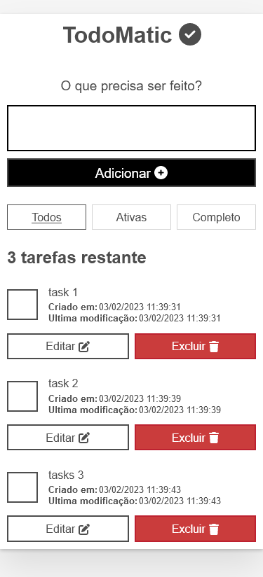
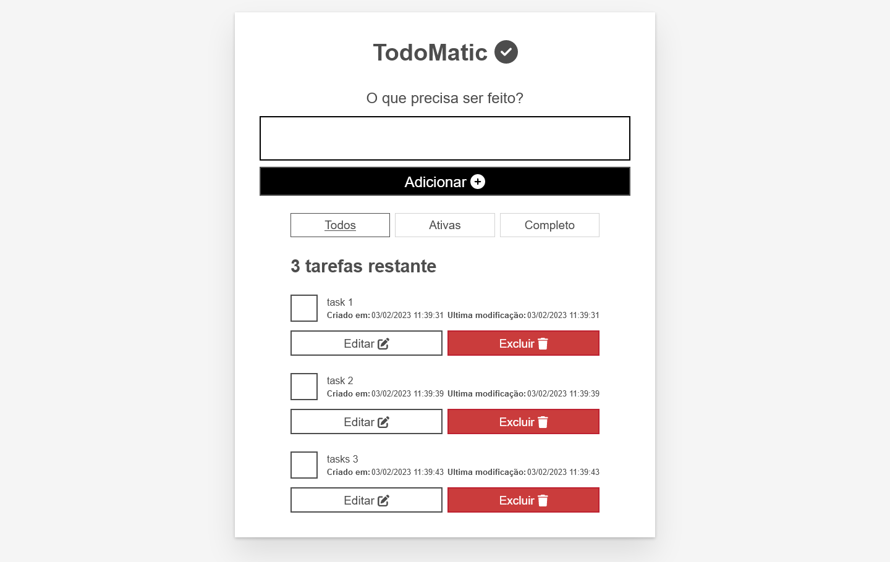

# TodoMatic

Um aplicativo que permite aos usuários adicionar, editar e excluir tarefas nas quais desejam trabalhar e também marcar tarefas como concluídas sem excluí-las. 

## Visão Geral

### Histórias de usuários do aplicativo

Como usuário, posso

 - [x] Ler uma lista de tarefas.
 - [x] Adicione uma tarefa usando o mouse ou o teclado.
 - [x] Marque qualquer tarefa como concluída, usando o mouse ou o teclado.
 - [x] Exclua qualquer tarefa, usando o mouse ou o teclado.
 - [x] Edite qualquer tarefa, usando o mouse ou o teclado.
 - [x] Visualize um subconjunto específico de tarefas: Todas as tarefas, apenas a tarefa ativa ou apenas as tarefas concluídas.

### Captura de tela

#### Mobile Result

#### Desktop Result

### Links

 - Solution URL: [Repository Project](https://github.com/Samuel-Amaro/moz-todo)
 - Live Site URL: [Result Live](https://samuel-amaro.github.io/moz-todo/)

### Construído com

 - Semantic HTML5 markup
 - CSS(Flexbox, Grid, Reset CSS)
 - Mobile-first workflow
 - RWD(Responsive Web Design)
 - TypeScript
 - React.JS Library
    - Hooks 
 - NPM
 - Methodology BEM(Block Element Modifier) - [BEM](http://getbem.com/introduction/) - Methodology
 - Web acessibility(attributesarias and roles)
 - API Web LocalStorage Browser
 - Font Awesome Icons - [Font Awesome](https://fontawesome.com/docs/web/use-with/react/) - Icons

## Execução do Projeto

### Getting Started with Create React App

This project was bootstrapped with [Create React App](https://github.com/facebook/create-react-app).

#### Available Scripts

In the project directory, you can run:

#### `npm start`

Runs the app in the development mode.\
Open [http://localhost:3000](http://localhost:3000) to view it in the browser.

The page will reload if you make edits.\
You will also see any lint errors in the console.

#### `npm test`

Launches the test runner in the interactive watch mode.\
See the section about [running tests](https://facebook.github.io/create-react-app/docs/running-tests) for more information.

#### `npm run build`

Builds the app for production to the `build` folder.\
It correctly bundles React in production mode and optimizes the build for the best performance.

The build is minified and the filenames include the hashes.\
Your app is ready to be deployed!

See the section about [deployment](https://facebook.github.io/create-react-app/docs/deployment) for more information.
